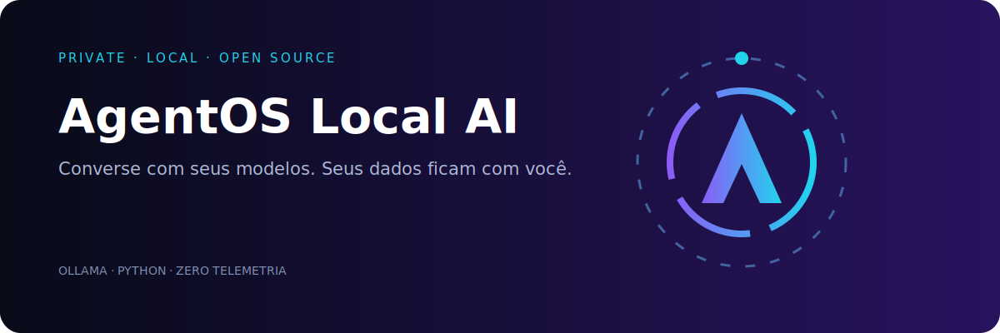

[](http://127.0.0.1:8787)

# AgentOS Local AI Starter

Assistente de IA local, privado e sem telemetria, com interface web e integração direta com [Ollama](https://ollama.com/).

## Começar

```bash
ollama pull llama3.2
python app.py
```

Abra `http://127.0.0.1:8787`. Configure outro modelo com `OLLAMA_MODEL` e outro servidor com `OLLAMA_URL`.

## Novidades

- Seletor automático dos modelos instalados no Ollama.
- Indicador de conexão, controle de criatividade e interface responsiva.
- Histórico persistente somente no navegador, com ações para limpar e exportar em JSON.
- Envio com Enter, Shift+Enter para nova linha e feedback enquanto o modelo responde.
- `GET /api/health` verifica se o Ollama está disponível.
- `GET /api/models` lista modelos locais instalados.
- Validação de mensagens, limite de requisição e cabeçalhos seguros por padrão.
- Configure o limite com `AGENTOS_MAX_BODY` em bytes.
- Servidor concorrente para manter a interface responsiva durante as requisições.

## Segurança

O servidor escuta apenas em `127.0.0.1`. Não o exponha à internet sem autenticação e HTTPS.

Projeto AgentOStudio · Licença MIT.
